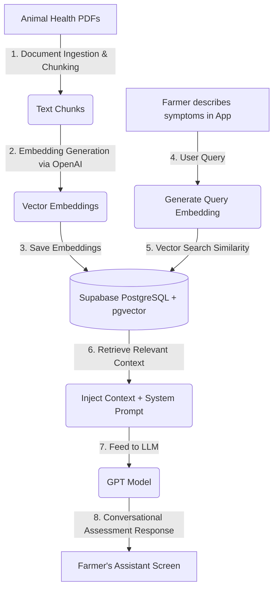

# Hutano Mudanga (Project X)
> **Mobile-first Animal Health & Vet Directory Platform for Southern Africa**

[](https://github.com/malmanyeza/Project-X)
[](https://reactnative.dev)
[](https://supabase.com)
[](https://www.postgresql.org)

Hutano Mudanga (translated from Shona as "Animal Health in the Kraal/Pen") is a mobile-first digital health platform built to empower livestock farmers in Southern Africa. By bridging the gap between local farmers and veterinary doctors, the app provides real-time consultations, digital herd record-keeping, offline-first syncing capabilities, and a Retrieval-Augmented Generation (RAG) powered AI livestock assistant to aid in preliminary diagnostics and animal care.

---

## Table of Contents
1. [Key Features](#key-features)
2. [RAG Architecture & Document Upload](#rag-architecture--document-upload)
3. [Technology Stack](#technology-stack)
4. [Project Structure](#project-structure)
5. [Getting Started & Installation](#getting-started--installation)
6. [Supabase & Backend Setup](#supabase--backend-setup)
7. [Deploying to Play Store](#deploying-to-play-store)
8. [License & Disclaimers](#license--disclaimers)

---

## Key Features

| Feature | Description | Screen / Implementation |
| :--- | :--- | :--- |
| **RAG AI Assistant** | Instant conversational diagnostics powered by GPT models and augmented with local animal health literature. | [AssistantScreen.tsx](file:///src/screens/farmer/AssistantScreen.tsx) |
| **Vet Geolocation Directory** | Interactive maps listing nearby registered veterinarians, filterable by distance, specialization, and ratings. | [VetDirectoryScreen.tsx](file:///src/screens/farmer/VetDirectoryScreen.tsx) |
| **Digital Herd Records** | Mobile animal registration profiles (cattle, poultry, goats, sheep, pigs) logging medical history, weight, and vaccines. | [AddAnimalScreen.tsx](file:///src/screens/farmer/AddAnimalScreen.tsx) |
| **Direct Real-time Chat** | Live chat between farmers and veterinarians including picture attachments for wound or symptom verification. | [ChatScreen.tsx](file:///src/screens/farmer/ChatScreen.tsx) |
| **Offline-First Sync** | Automatic caching using AsyncStorage / local state. Queues edits offline and synchronizes immediately on reconnection. | [supabase.ts](file:///src/lib/supabase.ts) |
| **Smart Notifications** | Push alerts reminding farmers of upcoming vaccination dates, scheduled vet visits, and chat responses. | [NotificationsScreen.tsx](file:///src/screens/farmer/NotificationsScreen.tsx) |

---

## RAG Architecture & Document Upload

To provide veterinary advice tailored specifically to regional guidelines, diseases, and environment, Hutano Mudanga implements Retrieval-Augmented Generation (RAG). This eliminates AI hallucinations and references actual veterinary manuals.



### How it Works:
1. **PDF Reference Loading**: Authoritative manuals on livestock management (vaccination tables, regional disease symptoms, diagnostic pamphlets) are uploaded.
2. **Text Embeddings & Vector Storage**: The documents are chunked and converted into vector representations using OpenAI's embedding API. These vectors are indexed and stored in Supabase utilizing the **pgvector** PostgreSQL extension.
3. **Contextual Retrieval**: When a farmer submits symptoms on [AssistantScreen.tsx](file:///src/screens/farmer/AssistantScreen.tsx), the query is embedded and compared against the database. The top matching information blocks are fetched.
4. **Augmented Prompt**: The system merges the retrieved veterinary context with the query and system prompts, generating a precise, conversational response from the AI assistant.

---

## Technology Stack

* **Frontend Framework**: React Native (Expo SDK 54) + TypeScript
* **State & Navigation**: React Navigation (Native Stack & Bottom Tabs), React Context API
* **Backend Database & Storage**: Supabase (PostgreSQL, Realtime DB, Auth, Bucket Storage)
* **AI & RAG Engine**: OpenAI API + Supabase Vector (pgvector) & Edge Functions
* **Maps & Geolocation**: React Native Maps + Expo Location API
* **Styling & Animations**: Vanilla Stylesheet + React Native Reanimated (Premium Dark Forest Green & Gold Palette)

---

## Project Structure

```text
Hutano Mudanga/
├── assets/                  # App icon, splash screen, and graphic assets
├── docs/                    # Specification documentation and Play Store listings
│   ├── playstore_listing.md # App copy and metadata for the Google Play Store
│   └── privacy.html         # Application privacy policy
├── src/                     # Frontend Application Source Code
│   ├── components/          # Reusable UI elements (ChatBubble, Avatar, VetCard, etc.)
│   ├── constants/           # Application theme, color palettes, and global keys
│   ├── context/             # Authentication and global state providers
│   ├── lib/                 # Core library initializations (Supabase client instance)
│   ├── navigation/          # React Navigation stacks (Farmer and Vet dashboards)
│   ├── screens/             # UI Screen flows
│   │   ├── auth/            # Sign In, Sign Up, and Password Recovery
│   │   ├── farmer/          # Home, Assistant, Vet Directory, Herd Profiles
│   │   ├── vet/             # Dashboard, Farmer Requests, Live Chats, Reports
│   │   └── onboarding/      # Welcome sliders and User Type selection
│   ├── services/            # API call orchestration (Auth, Animals, Chat, AI Assistant)
│   └── types/               # Global TypeScript definitions
├── supabase/                # Backend Configurations & Database Logic
│   └── functions/           # Supabase Deno Edge Functions
│       └── ai-assistant/    # Code managing GPT execution and chat synchronization
├── App.tsx                  # Main React Native application root component
├── package.json             # Core dependency registry
└── tsconfig.json            # TypeScript configuration
```

---

## Getting Started & Installation

### Prerequisites
Make sure you have the following installed on your machine:
* Node.js (v18 or higher recommended)
* Expo Go app on your physical test device, or an iOS Simulator / Android Emulator.

### Installation Steps

1. **Clone the repository:**
   ```bash
   git clone https://github.com/malmanyeza/Project-X.git
   cd Project-X
   ```

2. **Install project dependencies:**
   ```bash
   npm install
   ```

3. **Configure environment variables:**
   Create a configuration file in your codebase constants or create a `.env` file referencing:
   ```env
   SUPABASE_URL=your-supabase-project-url
   SUPABASE_ANON_KEY=your-supabase-anonymous-key
   ```

4. **Start the development server:**
   ```bash
   npx expo start
   ```

5. **Scan & Run:**
   Scan the generated QR code using the Expo Go app on Android or your iOS Camera to open the app on your physical device. Alternatively, press `a` for the Android emulator or `i` for the iOS simulator in the terminal.

---

## Supabase & Backend Setup

### 1. Vector Database Configuration (pgvector)
To enable RAG search on your PostgreSQL instance, activate the vector extension and create the reference tables:
```sql
-- Enable the pgvector extension to store document embeddings
create extension if not exists vector;

-- Create table for storing parsed animal health document chunks
create table document_sections (
  id bigserial primary key,
  document_name text not null,
  content text not null,
  embedding vector(1536) -- Matching OpenAI text-embedding-3-small/ada-002 dimensions
);

-- Index embeddings for efficient cosine similarity queries
create index on document_sections using ivfflat (embedding vector_cosine_ops)
  with (lists = 100);
```

### 2. Similarity Search Database Function
Deploy this function to search stored documents by proximity:
```sql
create or replace function match_document_sections (
  query_embedding vector(1536),
  match_threshold float,
  match_count int
)
returns table (
  id bigint,
  document_name text,
  content text,
  similarity float
)
language sql stable
as $$
  select
    document_sections.id,
    document_sections.document_name,
    document_sections.content,
    1 - (document_sections.embedding <=> query_embedding) as similarity
  from document_sections
  where 1 - (document_sections.embedding <=> query_embedding) > match_threshold
  order by document_sections.embedding <=> query_embedding
  limit match_count;
$$;
```

### 3. Deploying Supabase Edge Functions
To deploy the AI Assistant endpoint:
```bash
supabase functions deploy ai-assistant
supabase secrets set OPENAI_API_KEY=your-openai-api-key
```

---

## Deploying to Play Store

We use Expo Application Services (EAS) for production builds. For details on asset requirements and Google Play questionnaire compliance, view [playstore_listing.md](file:///docs/playstore_listing.md).

Build the production Android App Bundle (.aab):
```bash
eas build --platform android --profile production
```

---

## License & Disclaimers

This project is licensed under the MIT License - see the LICENSE file for details.

> [!IMPORTANT]
> **Medical Disclaimer:**
> The AI assistant (Mudanga) provides educational guidance and preliminary health suggestions based on vector search context. It does not replace professional veterinary inspection, clinical tests, or physical examinations. Always consult a qualified veterinary practitioner for diagnosis and treatment plans.
